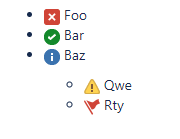

# Jira Markup Skill

<picture>
    <source media="(prefers-color-scheme: dark)" srcset="https://banners.beyondco.de/Jira%20Markup%20Skill.png?pattern=topography&style=style_1&fontSize=100px&md=1&showWatermark=1&icon=book-open&theme=dark&packageManager=&packageName=&description=by+The+Dragon+Code&images=book-open">
    
</picture>

> Agent skill and CLI for converting Markdown to Jira wiki markup.

## Install

```shell
npx skills add TheDragonSkills/jira-markup
```

## Usage

Ask the agent to format content for Jira, or run the converter directly:

```shell
node skills/jira-markup/scripts/converter.js "# Heading"
```

```shell
cat content.md | node skills/jira-markup/scripts/converter.js
```

Windows PowerShell:

```powershell
Get-Content -Raw -Path .\content.md | node .\skills\jira-markup\scripts\converter.js
```

## Output Example

Input:

```markdown
## Incident Summary

**Status:** Blocked

| Check | Result |
| --- | --- |
| API health | Passing |
| Export job | Failing |
```

Output:

```jira
h2. Incident Summary

*Status:* Blocked

||Check||Result||
|API health|Passing|
|Export job|Failing|
```

## Checklists

```markdown
- [ ] Foo
- [x] Bar
- [i] Baz
    - [!] Qwe
    - [flag] Rty
```

converts to:

```jira
* (x) Foo
* (/) Bar
* (i) Baz
** (!) Qwe
** (flag) Rty
```



## License

This package is licensed under the [MIT License](LICENSE.md).
